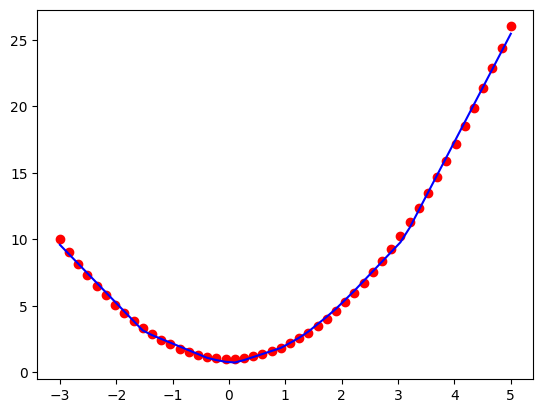

ToyAI
====

ToyAI repo contains the toy implementation of ML and AI concepts like gradient descent and

- __ToyGrad__: A toy implementation of [automatic differentiation](https://en.wikipedia.org/wiki/Automatic_differentiation), inspired by A. Karparthy's https://github.com/karpathy/micrograd
- __ToyGPT__: A toy implementation of GPT-2 transformer architecture in PyTorch, from Karpathy's
  tutorial: https://www.youtube.com/watch?v=l8pRSuU81PU

# ToyGrad

## Basic Concepts

See more about Autograd's basic concpets, architecture, and implementation at the [basic concept of automatic differentiation](toygrad/autograd.md).

## Demo

See demo in Jupyter [notebook how to use ToyGrad](toygrad/demo.ipynb).

```python
class Model(Module):
    def __init__(self, input_features, output_features):
        super().__init__()

        self.layer1 = Linear(input_features, 8)
        self.layer2 = Linear(8, 4)
        self.output = Linear(4, output_features)

    def forward(self, X):
        X = self.layer1(X)
        X = [xi.relu() for xi in X]
        X = self.layer2(X)
        X = [xi.relu() for xi in X]
        output = self.output(X)
        return output
```



# ToyGPT

## Implementation

ToyGPT implements the GPT-2 architecture, mostly from Karpathy's step-by-step explanation of the
re-implementing GPT-2 tutorial from  https://www.youtube.com/watch?v=l8pRSuU81PU.

It's a great lesson to learn about the inner workings of transformer architecture, from tokenization,
embedding, attention mechanism, and generation concepts like sampling.

```python
# initializing
def __init__(self, ...):
    self.transformer = nn.ModuleDict(
        dict(
            # embedding layer, translates input ids to embedding representation
            wte=nn.Embedding(config.vocab_size, config.n_embed),
            # positional encoding layer
            wpe=nn.Embedding(config.block_size, config.n_embed),
            # multi-head attention layers
            h=nn.ModuleList([Block(config) for _ in range(config.n_layers)]),
            # layer normalization
            ln_f=nn.LayerNorm(config.n_embed),
        )
    )
```

It currently supports inference on CPU.

See [modeling_gpt.py](toygpt/modeling_gpt.py).

## Demo

Example experiments with generations:

```python3
from modeling_gpt import GPT
model = GPT.from_pretrained('gpt2')

import sys

def gen(prompt, **kwargs):
    for t in model.generate(prompt=prompt, **kwargs):
        sys.stdout.write(t)
        sys.stdout.flush()

prompt = '''Hello world how are'''
gen(prompt, temperature=1.0, sampling=True)
```

Output:

```
 you doing? How are you doing? You don't have a job?

It's the most wonderful thing in the world. We're living in this world, you're so wonderful, I can't believe you're here. I'm so happy. It's the happiest day of my life
```